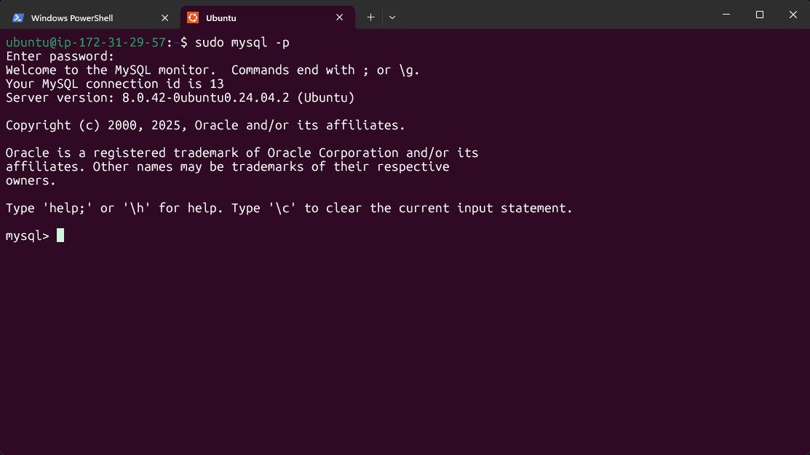
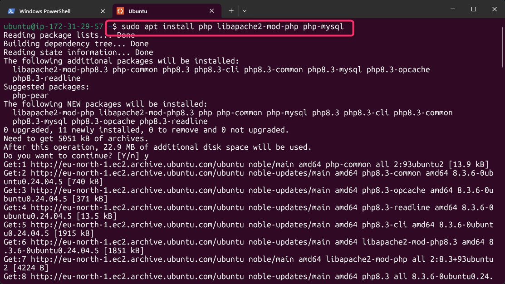

# 📘 LAMP Stack Implementation on AWS (EC2)
> **Linux | Apache | MySQL | PHP**

---

## 🧭 Introduction
The **LAMP stack** is a popular open-source web development platform used for hosting dynamic websites and web applications. It consists of four main components:

- **L**inux: The operating system  
- **A**pache: The web server  
- **M**ySQL: The relational database management system  
- **P**HP: The programming language (can also be replaced with Python or Perl)

This guide provides step-by-step instructions on how to set up and configure a LAMP stack on an **AWS EC2 instance** running **Ubuntu 24.04 LTS**.

---

## 🔧 Step 0: Preparing the Environment

Before we install the LAMP stack, we need to launch and prepare an EC2 instance.

### ✅ Tasks:

1. **Launch EC2 Instance:**
   - Log in to your AWS Management Console.
   - Navigate to **EC2 > Instances > Launch Instance**.
   - Choose an **Ubuntu 24.04 LTS AMI**.
   - Select the **t2.micro** instance type (Free Tier eligible).
   - Choose a region closest to your location (e.g., `eu-west-2a`).
   - Create a new key pair or use an existing one to SSH into the server.
   - Open necessary ports (SSH - 22, HTTP - 80) in the **Security Group**.
  
   - 
   - 


2. **Connect to the Instance:**
   Use the `.pem` file and connect via SSH:

   ```bash
   ssh -i "your-key-name.pem" ubuntu@<your-ec2-public-ip>
Replace your-key-name.pem with your actual key file and <your-ec2-public-ip> with the public IP of your instance.


## ⚙️ Step 1: Update the Package Manager

After connecting to your EC2 instance, it is recommended to update the package manager to ensure that all packages are up to date.


## 🌐 Step 2: Install Apache2

Apache is a widely used open-source web server software that will serve your web pages to users over the internet.


### ⚙️ Enable and Check Apache Service

To ensure Apache starts automatically on system boot and to verify that it is running properly, use the following commands:


🌍 Step 5: Test Apache Externally (From Browser)
To confirm that Apache is accessible over the internet, open your browser and visit the public IP of your EC2 instance:
http://<your-ec2-public-ip>:80
🔍 Example:
http://13.53.216.202:80
You should see the Apache2 Ubuntu Default Page, indicating that your server is successfully serving web pages.


## 🗄️ Step 2: Install MySQL

To handle data for your web application, you need a **Relational Database Management System (RDBMS)**.

In our case, we will install **MySQL**. MySQL is a widely used, open-source RDBMS that integrates seamlessly in PHP-based environments.


```bash
sudo apt install mysql-server -y
The -y flag automatically confirms the installation prompt.

Once installed, you can proceed to secure the database and start using it to create users, schemas, and tables for your web application.

## 🔐 Step 3: Log in to MySQL Console


To access the MySQL server as the administrative `root` user, run the following command:

```bash
sudo mysql
Running this command connects your shell to the MySQL server as the root user, thanks to the elevated privileges granted by sudo

🔑 Step 4: Set a Password for the Root User
Once inside the MySQL shell, assign a password to the root user and configure the authentication method to mysql_native_password.
or the purpose of this tutorial, we'll use PassWord.1 as the password.

## 🔐 Step 6: Log In to MySQL Console Using Root Password

After assigning a password to the `root` user, you should now log in using that password to verify access.

  




```bash
sudo mysql -p
The -p flag tells MySQL to prompt you for a password. You should see output like this:


Step 3 - Install PHP
1. Install php. So far, we have installed Apache to serve our web contents, and we installed Mysql to assist us store and manage our data. Now, we will install Php to process codes inorder to display dynamic content to the consumer user.


To set up php on our server, we are going to need the following installed:

php package
php-mysql (this is a PHP module that allows PHP to communicate with MySQL databases)
libapache2-mod-php _(this helps Apache to handle and understand PHP files) to get this all set up in the machine, run:


